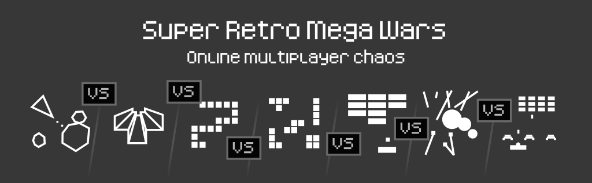
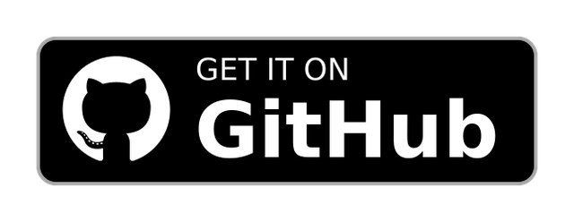
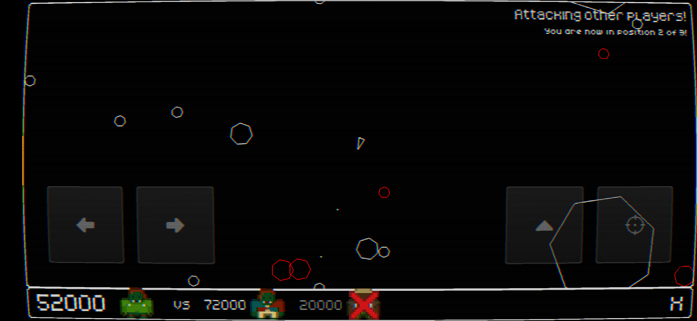
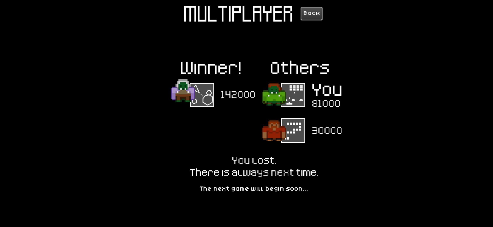
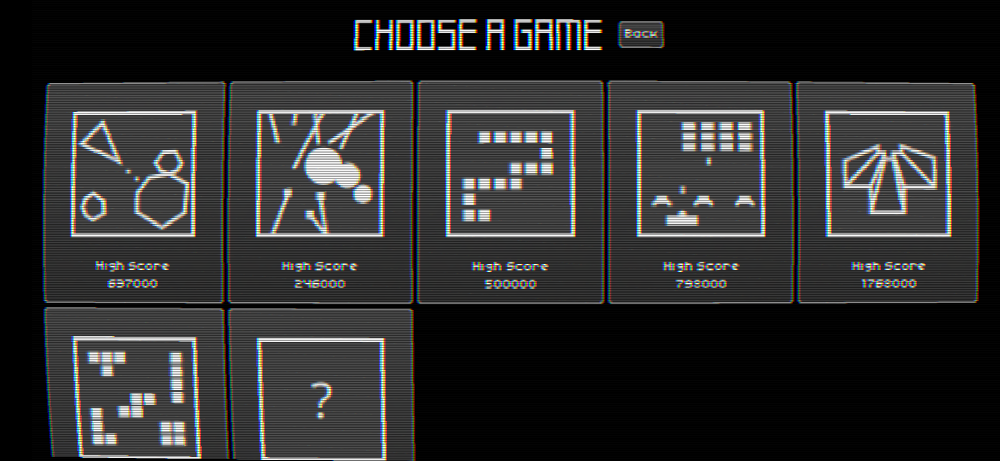
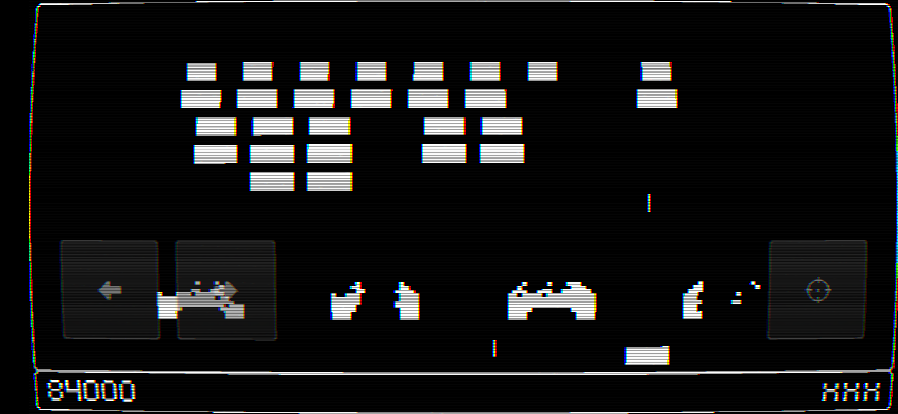

 

Enjoy retro games? Enjoy multiplayer games? Ever wanted to play one retro game against a different game in real time?

**Welcome to Meng Master!**

Play against your friends, with each of you can competing by playing a different game. Score points in your game and every other game will be handicapped in their own unique way. But watch out, as others score, your game will become more difficult too.

Six different single and multi-player versions of games based on classic retro titles, with more in the pipeline!

No ads. No in game purchases. Just retro games and good times.

Any feedback is very welcome at <a href="https://github.com/purnamasenthave-star/mengmaster/issues">GitHub</a>.

**Known limitations:**

* Thorough play testing required to balance the games.
* Untested on multiple screen sizes.

# Screenshots

   

# Contributing

## Donations

Meng Master is an open source, GPLv3 game. It will always be freely available via F-Droid, or for anyone to build, fork, or improve via the source code.

If you wish to support the development financially, donations are welcome via:

* [GitHub sponsors](https://github.com/sponsors/purnamasenthave-star)

## Reporting Issues

Please report any issues or suggest features on the [issue tracker](https://github.com/purnamasenthave-star/mengmaster/issues).

## Translating

We use [Weblate](https://hosted.weblate.org/engage/retrowars/) to manage translations. Please see [these instructions for using Weblate](https://hosted.weblate.org/engage/retrowars/) to translate retrowars.

> **Note:** After translations are completed in Weblate, a manual change is still required in this code base in order to enable the translation.
> This will typically be done on your behalf soon after the translation is added, but feel free to log an issue requesting it be done if there are any delays.
>
> The technical reason for this delay is because not all glyphs of each font are rendered.
> Doing so would result in an excessively large game (each font is rendered into PNGs of various font sizes, and fonts such as Google Noto have an impressively large number of glyphs).

|Game strings|F-Droid metadata|
|------------|----------------|
|||

## Submitting changes

Pull requests will be warmly received at [https://github.com/purnamasenthave-star/mengmaster](https://github.com/purnamasenthave-star/mengmaster), although it is often easier to first discuss your ideas via the [issue tracker](https://github.com/purnamasenthave-star/mengmaster/issues).

## Running a server

Documentation on running servers can be found at [the retrowars-server project](https://github.com/retrowars/retrowars-servers/#running-a-server).

Pull requests to the `retrowars/retrowars-servers` project will allow your server to appear in the default retro wars client when searching for public servers, and ensure that people can continue to play against each other even if the official servers are down.

# Compiling

This app uses a the libgdx library and Kotlin. It is recommended to read the [libgdx documentation to get a dev environment setup](https://libgdx.com/dev/setup/).

Alternatively, you can import the project into Android Studio and build from there.

# Attribution

* Various graphic assets - [Kenney](https://kenney.nl/)
* Music - Space Jacked Soundtrack - [Steam](https://store.steampowered.com/app/461060/Spacejacked__Soundtrack/) / [Free Music Archive](https://freemusicarchive.org/music/sawsquarenoise/RottenMage_SpaceJacked)
* Music - SynthKid - Last Breath - [BandCamp](https://synthkid.bandcamp.com/album/elsewhere) - 
* End game music: [Awakening - Old Clock](https://ds10forum.bandcamp.com/album/awakenings) - 

More detail on which specific free license is used for each asset can be found in the `./assets/` directory.
